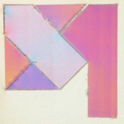

# Spell Catalogue

A modern listing of all recorded spells and their compositions. Spells are listed by their most original names, translated into the Common tongue.

## Absorb Elements

Composition: unknown

Composes: unknown

Projection 1        | Projection 2
:------------------:|:------------------:
 | 

## Aid

Composition: unknown

Composes: unknown

## Alarm

Composition: unknown

Composes: unknown

## Animate Dead

Composition: unknown

Composes: unknown

## Augury

Composition: unknown

Composes: [Legend Lore](#legend-lore)

## Bane

Composition: unknown

Composes: unknown

## Beacon of Hope

Composition: unknown

Composes: unknown

## Bestow Curse

Composition: unknown

Composes: unknown

## Bless

Composition: unknown

Composes: [Tenser's Transformation](#tenser's-transformation)

## Blindness/Deafness

Composition: unknown

Composes: unknown

## Blink

Composition: unknown

Composes: unknown

## Calm Emotions

Composition: unknown

Composes: unknown

## Catapult

Composition: unknown

Composes: unknown

## Catnap

Composition: unknown

Composes: unknown

## Ceremony

Composition: unknown

Composes: unknown

## Chaos Bolt

Composition: unknown

Composes: unknown

## Clairvoyance

Composition: unknown

Composes: unknown

## Color Spray

Composition: unknown

Composes: unknown

## Command

Composition: unknown

Composes: unknown

## Comprehend Languages

Composition: unknown

Composes: unknown

## Continual Flame

Composition: unknown

Composes: unknown

## Counterspell

Composition: [Dispel Magic](#dispel-magic) + [Shield](#shield)

Composes: unknown

## Create Food and Water

Composition: unknown

Composes: unknown

## Create or Destroy Water

Composition: unknown

Composes: [Tsunami](#tsunami)

## Cure Wounds

Composition: unknown

Composes: unknown

## Daylight

Composition: unknown

Composes: unknown

## Delayed Blast Fireball

Composition: [Fireball](#fireball) + [Slow](#slow)

Composes: unknown

## Detect Evil and Good

Composition: unknown

Composes: unknown

## Detect Magic

Composition: unknown

Composes: unknown

## Detect Poison and Disease

Composition: unknown

Composes: unknown

## Disguise Self

Composition: unknown

Composes: unknown

## Dispel Magic

Composition: unknown

Composes: [Counterspell](#counterspell)

## Enhance Ability

Composition: unknown

Composes: [Tenser's Transformation](#tenser's-transformation)

## Entangle

Composition: unknown

Composes: unknown

## Expeditious Retreat

Composition: unknown

Composes: unknown

## False Life

Composition: unknown

Composes: unknown

## Fast Friends

Composition: unknown

Composes: unknown

## Feather Fall

Composition: unknown

Composes: unknown

## Feign Death

Composition: unknown

Composes: unknown

## Find Familiar

Composition: unknown

Composes: [Find Greater Steed](#find-greater-steed), [Project Image](#project-image)

## Find Greater Steed

Composition: [Find Familiar](#find-familiar) + [Summon Beast](#summon-beast)

Composes: unknown

## Find Traps

Composition: unknown

Composes: unknown

## Fireball

Composition: unknown

Composes: [Delayed Blast Fireball](#delayed-blast-fireball)

## Flesh to Stone

Composition: [Hold Person](#hold-person) + [Meld Into Stone](#meld-into-stone)

Composes: unknown

## Fog Cloud

Composition: unknown

Composes: unknown
 
## Gentle Repose

Composition: unknown

Composes: unknown

## Gift of Alacrity

Composition: unknown

Composes: unknown

## Glyph of Warding

Composition: unknown

Composes: unknown

## Guiding Bolt

Composition: unknown

Composes: unknown

## Gust of Wind

Composition: unknown

Composes: unknown

## Hail of Thorns

Composition: unknown

Composes: unknown

## Healing Word

Composition: unknown

Composes: unknown

## Hex

Composition: unknown

Composes: unknown

## Hold Person

Composition: unknown

Composes: [Flesh to Stone](#flesh-to-stone)

## Identify

Composition: unknown

Composes: unknown

## Incite Greed

Composition: unknown

Composes: unknown

## Inflict Wounds

Composition: unknown

Composes: unknown

## Invisibility

Composition: unknown

Composes: unknown

## Jump

Composition: unknown

Composes: unknown

## Knock

Composition: unknown

Composes: unknown

## Legend Lore

Composition: [Augury](#augury) + [Speak with Dead](#speak-with-dead)

Composes: unknown

## Lesser Restoration

Composition: unknown

Composes: unknown

## Life Transference

Composition: unknown

Composes: unknown

## Lightning Bolt

Composition: unknown

Composes: unknown

## Locate Object

Composition: unknown

Composes: unknown

## Mage Armor

Composition: unknown

Composes: unknown

## Magic Circle

Composition: unknown

Composes: unknown

## Magic Missile

Composition: unknown

Composes: unknown

## Mass Healing Word

Composition: unknown

Composes: unknown

## Meld into Stone

Composition: unknown

Composes: [Flesh to Stone](#flesh-to-stone)

## Mirror Image

Composition: unknown

Composes: [Project Image](#project-image)

## Moonbeam

Composition: unknown

Composes: unknown

## Motivational Speech

Composition: unknown

Composes: unknown

## Nondetection

Composition: unknown

Composes: unknown

## Prayer of Healing

Composition: unknown

Composes: unknown

## Project Image

Composition: [Mirror Image](#mirror-image) + [Find Familiar](#find-familiar)

Composes: unknown

## Protection from Energy

Composition: unknown

Composes: unknown

## Protection from Evil and Good

Composition: unknown

Composes: unknown

## Protection from Poison

Composition: unknown

Composes: unknown

## Purify Food and Drink

Composition: unknown

Composes: unknown

## Remove Curse

Composition: unknown

Composes: unknown

## Revivify

Composition: unknown

Composes: unknown

## Rope Trick

Composition: unknown

Composes: unknown

## Sanctuary

Composition: unknown

Composes: unknown

## Searing Smite

Composition: unknown

Composes: unknown

## Sending

Composition: unknown

Composes: unknown

## Shadow Blade

Composition: unknown

Composes: unknown

## Shield

Composition: unknown

Composes: [Counterspell](#counterspell)

## Shield of Faith

Composition: unknown

Composes: unknown

## Silence

Composition: unknown

Composes: unknown

## Silent Image

Composition: unknown

Composes: unknown

## Sleep

Composition: unknown

Composes: unknown

## Slow

Composition: unknown

Composes: [Delayed Blast Fireball](#delayed-blast-fireball)

## Speak with Dead

Composition: unknown

Composes: [Legend Lore](#legend-lore)

## Spirit Guardians

Composition: unknown

Composes: unknown

## Spiritual Weapon

Composition: unknown

Composes: unknown

## Suggestion

Composition: unknown

Composes: unknown

## Summon Beast

Composition: unknown

Composes: [Find Greater Steed](#find-greater-steed)

## Summon Undead

Composition: unknown

Composes: unknown

## Tasha's Hideous Laughter

Composition: unknown

Composes: unknown

## Tenser's Transformation

Composition: [Bless](#bless) + [Enhance Ability](#enhance-ability)

Composes: unknown

## Tenser's Floating Disc

Composition: unknown

Composes: unknown

## Tiny Hut

Composition: unknown

Composes: unknown

## Tongues

Composition: unknown

Composes: unknown

## Tsunami

Composition: [Create or Destroy Water](#create-or-destory-water) + [Wall of Force](#wall-of-force)

Composes: unknown

## Unseen Servant

Composition: unknown

Composes: unknown

## Wall of Force

Composition: unknown

Composes: [Tsunami](#tsunami)

## Warding Bond

Composition: unknown

Composes: unknown

## Water Breathing

Composition: unknown

Composes: unknown

## Water Walk

Composition: unknown

Composes: unknown

## Web

Composition: unknown

Composes: unknown

## Zone of Truth

Composition: unknown

Composes: unknown

